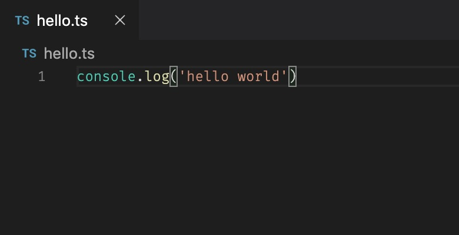

Hello there!

You should pay close attention to the dimensions of your image, the 1.91:1 ratio is no joke and you should follow it. Otherwise images such as this get cropped weirdly. Eg 440x220 fits pretty nicely a Twitter card.

Of course if you want to use a 1:1 image with a smaller card you can. Then you just have to use cardType 'summary' for the twitter props _and_ if you want that image to be displayed as a card in Facebook as well, the size to be under 400x209. I'd say a 300x300 or 200x200 image will work fine.

Funny thing also that .png images don't work with gatsby-plugin-sharp. I have no idea why but they just don't.

This blog is awesome.
